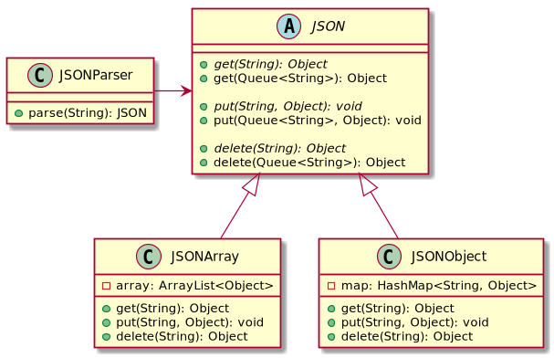

# High Performance Event Correlation System

Acest proiect implementeza o structura de date care eficientizeaza interogarea si manipularea obiectelor de tip JSON.
Operatiile posibile pe aceasta structura sunt:
1. put(succesiune_chei, valoare)
2. get(succesiune_chei)
3. delete(succesiune_chei)

## Detalii despre implementare

Clasa de baza prin intermediul careia se efectueaza operatiile este clasa abstracta `JSON`. Aceasta defineste trei metode
abstracte `get(String)`, `put(String, Object)` si `delete(String)`, care primesc ca parametru o cheie in format String
si efectueaza operatia numita. Implementarea acestor metode depinde de tipul de container JSON (array sau object). Din 
aceasta cauza, clasa `JSON` este extinsa de clasele `JSONArray` si `JSONObject`. Prima stocheaza elementele intr-un 
`ArrayList<Object>`, iar cea de-a doua intr-un `HashMap<String, Object>`. Aceste structuri de date permit oferirea 
unei complexitati de timp minime pentru cele trei operatii.

Bazandu-se pe metodele abstracte implementate in sub-clase, `JSON` implementeaza logica celor trei operatii in cazul in
care se doreste interogarea unei succesiuni de chei. Daca in timpul accesarii este intampinata o eroare,
este aruncata o exceptie de tipul `JSONException`, care contine un mesaj informativ despre cauza erorii:
* ERROR_NOT_ARRAY
* ERROR_NOT_OBJECT
* ERROR_INDEX_OUT_OF_RANGE
* KEY_NOT_FOUND

### Testarea aplicatiei

Proiectul a fost testat folosind 6 seturi de teste, fiecare avand o complexitate mai mare decat cel anterior. Fiecare set
de teste contine 3 fisiere:
1. fisierul JSON
2. lista de comenzi ce trebuie efectuate de catre aplicatie
3. lista raspunsurilor de referinta pentru comenzile efectuate

La final, fisierul cu raspunsurile de referinta este comparat cu fisierul de output efectiv pentru a se evalua performanta
sistemului. Codul de testare este disponibil in folderul standard, insa setul de teste nu a fost facut public.